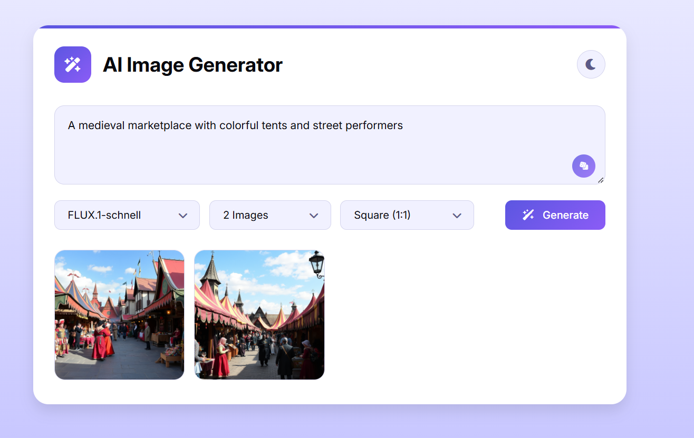

# 🎨 AI Image Generator

A modern and responsive **AI Image Generator** web application built using **HTML, CSS, and JavaScript**. The application allows users to generate AI-powered images from text prompts using **Hugging Face Inference API**.

Users can select an AI model, choose the number of images, select an aspect ratio, and generate images based on their imagination.

---

## 🚀 Live Demo

🔗 **Live Demo:** Add your GitHub Pages URL here

---

## 📸 Preview

Add your project screenshot here:





---

## ✨ Features

- 🎨 Generate images using text prompts
- 🤖 Multiple AI model selection
- 🖼️ Generate 1–4 images at a time
- 📐 Multiple aspect ratios:
  - Square (1:1)
  - Landscape (16:9)
  - Portrait (9:16)

- 🎲 Random prompt generator
- 🌙 Dark / Light theme
- 💾 Download generated images
- ⏳ Loading animation while images are generating
- ⚠️ Error handling for failed image generation
- 📱 Responsive design for desktop, tablet, and mobile
- 🎯 Clean and modern user interface
- 💾 Theme preference saved using Local Storage

---

## 🛠️ Technologies Used

### Frontend

- HTML5
- CSS3
- JavaScript (ES6+)
- Font Awesome
- Google Fonts

### API

- Hugging Face Inference API
- AI Image Generation Models

---

## 🤖 Supported AI Models

The application provides options for different image-generation models, including:

- **FLUX.1-dev**
- **FLUX.1-schnell**
- **Stable Diffusion XL**
- **Stable Diffusion v1.5**
- **Openjourney**

> Model availability may depend on the Hugging Face API and the selected model's current availability.

---

## 📂 Project Structure

```text
AI-Image-Generator/
│
├── images/
│   └── preview.png
│
├── index.html
├── style.css
├── script.js
└── README.md
```

---

## ⚙️ How to Run Locally

### 1. Clone the Repository


git clone https://github.com/NileshPadalwar/AI_Image_Generator.git


### 2. Navigate to the Project


cd AI_Image_Generator


### 3. Add Hugging Face API Key

Open:


script.js


Find:


const API_KEY = "";


Add your Hugging Face API token:

const API_KEY = "YOUR_HUGGING_FACE_TOKEN";


### 4. Run the Project

You can open `index.html` directly in your browser.

For a better development experience, use **VS Code Live Server**.

---

## 🔑 Getting a Hugging Face API Token

1. Create an account on Hugging Face.
2. Open your account settings.
3. Create an access token.
4. Copy the token.
5. Add it to your project configuration.

> ⚠️ **Security Note:** Do not commit your API token to GitHub. For a production application, the API request should be handled through a backend server so that the API key is not exposed in frontend JavaScript.

---

## 🖼️ How to Use

### Step 1 — Enter a Prompt

Describe the image you want to generate.

Example:


A futuristic city with flying cars, neon lights and skyscrapers at night


### Step 2 — Select an AI Model

Choose an available model from the model dropdown.

### Step 3 — Select Image Count

Choose between:


- 1 Image
- 2 Images
- 3 Images
- 4 Images


### Step 4 — Select Aspect Ratio

Choose:

\
- Square (1:1)
- Landscape (16:9)
- Portrait (9:16)


### Step 5 — Generate

Click the **Generate** button and wait for the AI-generated images.

### Step 6 — Download

Hover over a generated image and click the **Download** button to save it.

---

## 🎲 Random Prompt Generator

The application includes a random prompt button that automatically fills the prompt field with an example prompt.

Example prompts include:

- Magic forests
- Steampunk airships
- Mars colonies
- Dragons
- Underwater kingdoms
- Cyberpunk cities
- Magical libraries
- Japanese temples
- Fantasy worlds

---

## 🌙 Dark & Light Mode

The application supports both:

- ☀️ Light Mode
- 🌙 Dark Mode

The selected theme is saved in the browser using:


localStorage;


This means the user's theme preference remains available when they revisit the application.

---

## 📐 Responsive Design

The application is designed to work across different screen sizes.

| Device     | Supported |
| ---------- | --------- |
| 💻 Desktop | ✅        |
| 💻 Laptop  | ✅        |
| 📱 Mobile  | ✅        |
| 📱 Tablet  | ✅        |

---

## 🔮 Future Improvements

Possible future enhancements include:

- 🔐 Backend API integration
- 🔑 Secure API key management
- 🖼️ Image history
- ❤️ Favorite images
- 🗑️ Delete generated images
- 📥 Download all generated images
- 🎨 More AI models
- ⚙️ Advanced generation settings
- 🔄 Regenerate image option
- 📤 Image sharing
- 📊 Generation history
- 👤 User authentication

---

## ⚠️ API Limitations

Image generation depends on the Hugging Face Inference API.

Generation time and model availability may vary depending on:

- Selected model
- API availability
- Server load
- Account/API limits
- Prompt complexity

---

## 📄 License

This project is created for **learning and portfolio purposes**.

Feel free to use the project as a reference for learning HTML, CSS, JavaScript, API integration, and AI image generation.

---

## 👨‍💻 Author

**Nilesh Padalwar**

Frontend Developer | Angular Developer | 

---

⭐ If you found this project useful, consider giving the repository a **star** on GitHub.
